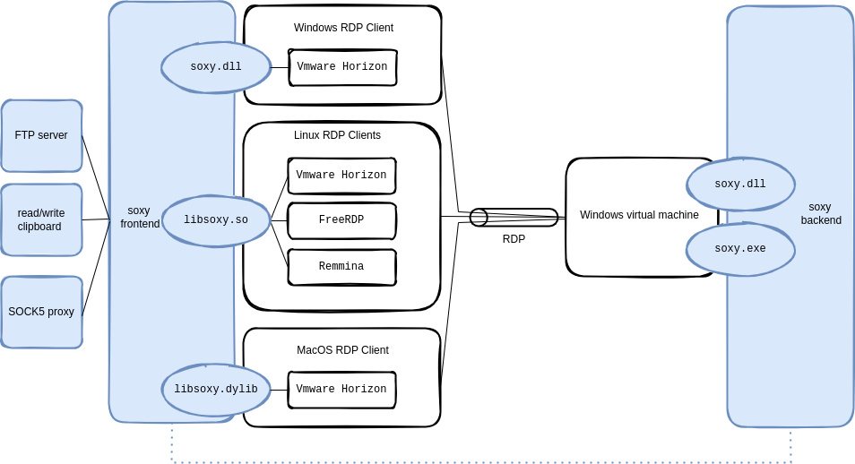

# soxy

[](https://github.com/airbus-seclab/soxy/actions/workflows/clippy.yml)
[](https://github.com/airbus-seclab/soxy/actions/workflows/build.yml)

soxy is a modular tool to interact with several VDIs that operates over RDP,
such as VMware Horizon, Citrix and native Windows RDP. It supports useful debug
services (e.g. clipboard, console/shell, sharing, FTP server, SOCKS5 proxy).

## 🎯 Features

soxy has a frontend and a backend component. The latter executes inside a
Windows instance managed by one of the supported VDIs, while the frontend
bridges access to backend functions by exposing VDI-side resources locally using
a common protocol. At the time of writing, soxy provides:

- a bootstrap module using a PowerShell backend script ("stage0");
- a (basic) FTP server to access the virtual machine's filesystem;
- a telnet-like interface to spawn and interact with a console/shell executed on
  the virtual machine;
- a telnet-like interface to read/write the Windows clipboard of the virtual
  machine;
- a SOCKS5 proxy which permits to open connections on client's side as if it was
  opened in the virtual machine.

soxy is a more stable, complete and modular alternative to existing tools such
as [SocksOverRDP](https://github.com/nccgroup/SocksOverRDP),
[ica2TCP](https://github.com/synacktiv/ica2tcp), and
[rdp2tcp](https://rdp2tcp.sourceforge.net).

soxy supports native Windows RDP (real or virtual host) as well as VMware
Horizon and Citrix virtual machines.

On the client side, soxy works as a plugin on:

- VMware Horizon client on Linux, macOS and Windows;
- FreeRDP and Remmina on Linux;
- Citrix client on Linux, macOS and Windows.

On the remote host, soxy can run as a standalone Windows executable or can be
embedded in other applications as a DLL. In release mode, this part of soxy is
to be as small as possible (<200KB). It is built without any logging related
code (even log message strings are absent from the binary) and without symbols.




## Table of Contents

- [Project Architecture](#-project-architecture)
- [Getting Started](#-getting-started)
  - [Build](#-build)
  - [Frontend Installation](#-frontend-installation)
  - [Backend Installation](#-backend-installation)
- [Usage](#-usage)
- [Contributing](#-contributing)
- [License](#-license)


## 📁 Project Architecture

The soxy source code is split into four parts:

- **frontend**: contains the code of the dynamic library to be installed on the
  client's machine and loaded by FreeRDP (or Remmina), VMware Horizon viewer, or
  Citrix. This part of soxy accepts TCP connections on the client's side (or
  local network, depending on the configuration) for each service;
- **backend**: contains the code of the Windows executable
  (or DLL) to be launched (or loaded) on the remote Windows machine;
- **standalone**: contains the code to produce an exectuable including both the
  `frontend` and the `backend` parts (with an emulated RDP channel) for testing
  implementations of services;
- **common**: contains some code used by all other parts.

All communications between the `frontend` and the `backend` go through
a single [Static Virtual Channel](https://learn.microsoft.com/en-us/openspecs/windows_protocols/ms-rdpbcgr/343e4888-4c48-4054-b0e3-4e0762d1993c)
of the RDP protocol. A single FIFO is used to transmit from/to the `frontend`
to/from `backend`, which means that there is no priority levels between services
within soxy.

**Note**: There is no rate limiting feature implemented in soxy. Under heavy
load, other channels (i.e. keyboard, mouse, display, USB, ...) can be slowed
down, depending on the underlying implementation (Windows native RDP, VMware
Horizon, Citrix).


## 🚀 Getting Started

### 🔨 Build

#### Pre-compiled Binaries

Pre-compiled binaries can be found in the
[Releases](https://github.com/airbus-seclab/soxy/releases) section of the
project on Github. The build step can be skipped, and these binaries may be used
as described in the next sections.

#### On Linux

All Linux and Windows libraries and executables of soxy can be built on Linux.


##### Requirements

The following elements are required to build them:

- `make`;
- `mingw-w64` package on Arch, Debian and Ubuntu, `mingw64-gcc` and
  `mingw32-gcc` on Fedora;
- [rustup](https://rustup.rs/) installed (see next section).


##### Make Targets

The `Makefile` contains three main targets:

- `setup`: invokes `rustup` to install all needed toolchains, targets and
  components for Rust;
- `debug`: builds non-stripped libraries and executables with debugging logs
  activated. Outputs to a repository named `debug`;
- `release`: builds stripped and optimized libraries and executables with
  informational logs for the frontend libraries and standalone binaries, but
  without any logs for the backend libraries and binaries. Outputs to a
  repository named `release`.
  
The output hierarchy of the created repositories is the following:

```
├── backend
│   ├── win32
│   │   ├── soxy.dll
│   │   └── soxy.exe
│   └── win64
│       ├── soxy.dll
│       └── soxy.exe
├── frontend
│   ├── linux64
│   │   └── libsoxy.so
│   ├── win32
│   │   └── soxy.dll
│   └── win64
│       └── soxy.dll
└── standalone
    ├── linux64
    │   └── soxy_standalone
    └── win64
        └── soxy_standalone.exe
```

#### On macOS

Only the frontend can be build on macOS. Proceed as follows.

For the debug version:

```bash
cd frontend
cargo build --features log
```

For the release version:

```bash
cd frontend
cargo build --release
```

This produces `target/debug/libsoxy.dylib` or `target/release/libsoxy.dylib`
installable as described in the next section.

### 🔌 Frontend Installation

#### For VMware Horizon Client

##### On macOS

Copy `libsoxy.dylib` to `/Applications/VMware Horizon Client.app/Contents/Library/pcoip/vchan_plugins/rdpvcbridge/`.

##### On Linux

Copy the frontend library into the VMware `rdpvcbridge` directory:

```bash
sudo cp release/frontend/linux64/libsoxy.so /usr/lib/vmware/rdpvcbridge/
```

**Note**: on recent versions of VMware Horizon client, the directory has moved
to `/usr/lib/omnissa/rdpvcbridge/`.

##### On Windows

Register the `frontend` library for automatic loading by VMware Horizon client:

```bash
regsvr32.exe soxy.dll
```

To uninstall:

```bash
regsvr32.exe /u soxy.dll
```

#### For FreeRDP and Remmina (Linux)

Create the FreeRDP plugin directory and copy the library to it. Be careful, the
name of the library **must** be `libsoxy-client.so` (not `libsoxy.so`) otherwise
the library will not be found by FreeRDP/Remmina:

* for FreeRDP 2:

  ```bash
  sudo mkdir -p /usr/lib/x86_64-linux-gnu/freerdp2
  sudo cp release/frontend/linux64/libsoxy.so /usr/lib/x86_64-linux-gnu/freerdp2/libsoxy-client.so
  ```
* for FreeRDP 3:

  ```bash
  sudo mkdir -p /usr/lib/freerdp3
  sudo cp release/frontend/linux64/libsoxy.so /usr/lib/freerdp3/libsoxy-client.so
  ```

When you launch FreeRDP from the command line, you have to add the argument
`/vc:soxy` to tell FreeRDP to load the library, for example:

* for FreeRDP 2:

  ```bash
  xfreerdp /dynamic-resolution /log-level:INFO /u:User /v:192.168.42.42 /vc:soxy
  ```
* for FreeRDP 3:

  ```bash
  sdl-freerdp3 /dynamic-resolution /log-level:INFO /u:User /v:192.168.42.42 /vc:soxy
  ```

For Remmina, edit your RDP connection, got to the "Advanced" tab and set the
"Static virtual channel" parameter to `soxy`.

#### For Citrix Workspace App

##### On macOS

_TODO_

##### On Linux

First copy `libsoxy.so` to `/opt/Citrix/ICAClient/`, then modify
`/opt/Citrix/ICAClient/config/module.ini`:

- add `soxy` in the `VirtualDriver` list in the `[ICA 3.0]` section
- in the same section, add the line `soxy=On`
- add a `[soxy]` section containing the following line:
  - `DriverName = libsoxy.so`

##### On Windows

First copy the **win32** version of `soxy.dll` to `C:\Program Files
(x86)\Citrix\ICA Client`, then register it for automatic loading by Citrix
Workspace App; you need to run the command with administrator privileges:

```bash
regsvr32.exe soxy.dll
```

To uninstall:

```bash
regsvr32.exe /u soxy.dll
```

### 🔌 Backend Installation

#### Using `soxy.exe`

Copy `release/win64/soxy.exe` to the machine you are connected to and execute
it.

#### (Alternative) Using the DLL

Copy `release/win64/soxy.dll` (or `release/win32/soxy.dll` depending on the
Windows architecture) and _find your way to load the DLL_. For example, this can
be done thanks to `rundll32.exe` present on Windows with the following command:

```bash
rundll32.exe soxy.dll,Main
```

The `Main` function executed by the above command is a simple infinite sleeping
loop, avoiding `rundll32.exe` from exiting, while the real work of soxy runs in
threads launched at loading time by the `DllMain` function present in the DLL.
If the DLL is loaded by a real binary/application, soxy will remain active until
the binary/application exits; you do not have to execute anything in the
library, everything will be done automatically at loading time.


## 💻 Usage

After setting up the client and running the backend, you can use the following
services.

### Accessing Services

As soon as you have your favorite client setup and the _backend_ code running,
you can start using soxy services from your client machine

#### Remote Clipboard

Connect to `localhost:3032` on your client machine with a telnet-like command
such as `nc`, and use the available commands:

- `write xxxx` or `put xxxx`: sets the remote clipboard to the value `xxxx`;
- `read` or `get`: retrieves the content of the remote clipboard;
- `exit` or `quit`: closes the connection.

#### Remote Console/Shell

Connect to `localhost:3031` on your client machine with a telnet-like command
such as `nc`, and use the available commands.

#### Remote Filesystem

Connect to `localhost:2021` on your client machine with your favorite FTP client
to browse, upload, download files and directories accessible to the backend
user.

#### SOCKS5 Proxy

Configure on your client machine to use `localhost:1080` as a SOCKS5 proxy.
Connections will originate from the remote host.

#### Stage0

Connect to `localhost:1081` on your client machine with a telnet-like command
such as `nc`, and use the available command:

- `cat xxxx`, `push xxxx`, `put xxxx`, `send xxxx`, `upload xxxx`: sends the
  content of the file at the provided path.

## 🚧 Contributing

Adding a new service (let's called it `ping`) in soxy requires to develop a new
module in the `common` directory and to instantiate it in both the `frontend`
and the `backend`.

### Steps

1. Update `common/src/api.rs`:
   - Define a unique name: `const SERVICE_PING: &str = "ping";`
   - Add a `Ping` variant to the `Service` enum;
2. Declare the new module in `common/src/lib.rs`: `pub mod ping`;
3. Create a new module structure:

```
common/src/ping/
├── backend.rs
├── frontend.rs
└── mod.rs
```

4. Implement `service::Frontend` in `common/src/ping/frontend.rs` and
   `service::Backend` in `common/src/ping/backend.rs`.

Refer to `common/src/clipboard/` for examples.


## 🏢 License

This project is licensed under the GPLv3 License. See the [LICENSE](LICENSE)
file for details.
